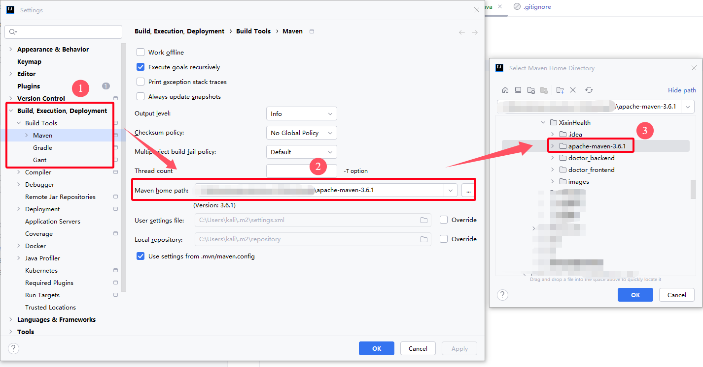
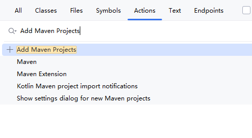
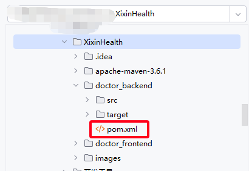
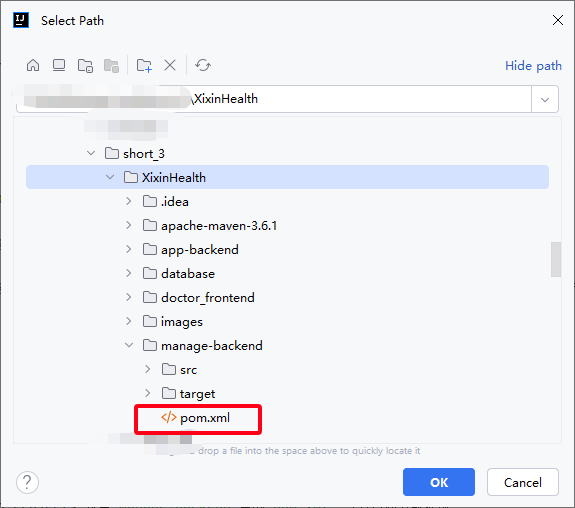

# XixinHealth
大三小学期拓展项目“熙心健康”

## App后端运行(以IDEA为例)

`jdk 1.8`

设置Maven目录为根目录下的`apache-maven-3.6.1`文件夹

在IDEA中 按下`Ctrl+Shift+A` 输入Add Maven Projects 选中`app-backend`中的`pom.xml` 等待自动下载依赖

运行`app-backend`中的`TijianServerRunApplication.java`即可启动后端

点击 [这里](http://localhost:8080/tijian/test) 测试后端

点击 [这里](https://doc.apipost.net/docs/detail/49370fac9cb5000?target_id=136e7138312008&locale=zh-cn) 查看API文档

## Manage后端运行

`jdk 1.8`

设置Maven目录为根目录下的`apache-maven-3.6.1`文件夹

在IDEA中 按下`Ctrl+Shift+A` 输入Add Maven Projects 选中`manage-backend`中的`pom.xml` 等待自动下载依赖

运行`manage-backend`中的`TijiancmsserverRunApplication.java`即可启动后端

点击 [这里](http://localhost:8088/tijiancms/test) 测试后端

点击 [这里](https://doc.apipost.net/docs/detail/493ccecdf8b5000?locale=zh-cn&target_id=13cb8af3b12013) 查看API文档

## 用户端运行结果

## 医生端运行结果

